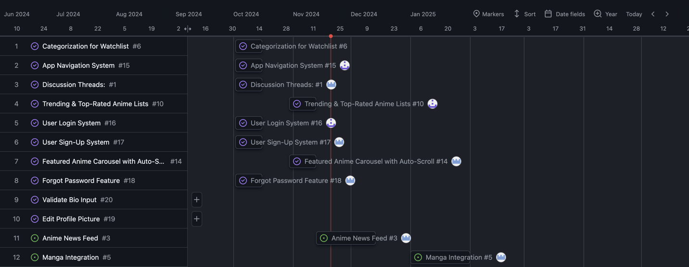
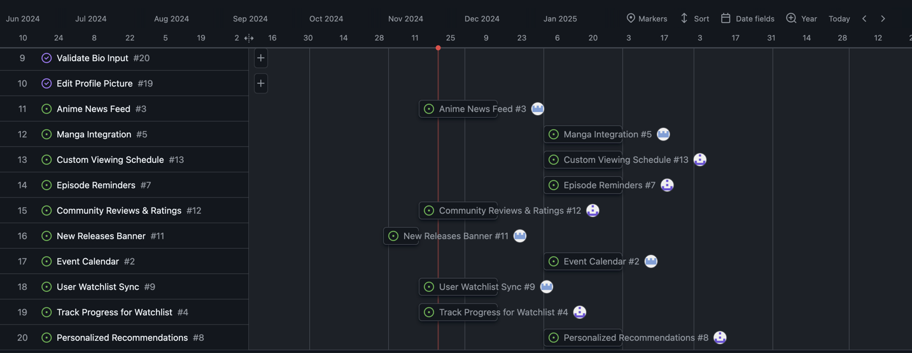

# Anime Lock

## Table of Contents

1. [Overview](#Overview)
1. [Product Spec](#Product-Spec)
1. [Wireframes](#Wireframes)
1. [Phase 1](#Phase-1)
2. [Phase 2](#Phase-2)
3. [App Demo Video](#App-Demo-Video)

## Overview

### Description
Anime Lock is a straightforward app for keeping track of your anime-watching progress and discovering new shows. It helps you manage your watchlist, stay updated on the latest releases, and explore series that match your interests. The app also features a community space to share thoughts, find recommendations, and connect with other anime fans. Whether you're new to anime or a longtime fan, Anime Lock makes staying organized and engaged with the anime world easier.

### App Evaluation

- **Category:**
  - Anime Tracking and Discovery
- **Mobile:**
  - Available on Android platforms, providing a user-friendly interface optimized for mobile devices to facilitate on-the-go anime management.
- **Story:**
  - AnimeLock is designed to enrich the anime-watching experience, enabling users to track their progress and discover new series tailored to their preferences. With features that encourage community engagement, it creates a narrative of shared passion among anime enthusiasts.
- **Market:**
  - Targeting anime fans of all ages, from newcomers to seasoned viewers, in a growing market driven by the increasing popularity of anime globally. Competing with other tracking apps, AnimeLock stands out with its personalized features and community focus.
- **Habit:**
  - Promotes regular engagement with anime through episode reminders, personalized recommendations, and social interactions. Users are encouraged to form a routine around their anime-watching habits, making it easier to integrate into daily life.
- **Scope:**
  - The app encompasses a wide range of features, including personalized watchlists, discovery tools, community interaction, and event tracking, making it a comprehensive solution for managing anime interests. Future enhancements could include additional integrations, like partnerships with streaming services or expanded community features.
 

## Product Spec

### 1. User Features (Required and Optional)

**Required Features**

1. *Personalized Watchlist*:
   - Users can add anime series to their watchlist and track their progress by marking episodes as watched.
2. *Categorization*:
   - Organize the watchlist with custom categories like “Currently Watching,” “Completed,” “On Hold,” and “Dropped.”
3. *Episode Reminders*:
   - Set notifications for upcoming episodes of ongoing series.
4. *Personalized Recommendations*:
   - AI-driven suggestions for new anime series based on watch history and preferences.
5. *Trending & Top-Rated Lists*:
   - Access curated lists of popular and highly-rated anime.
6. *Community Reviews & Ratings*:
    - Read and contribute reviews and ratings from other users.
7.  *Anime News Feed*:
    - Stay updated with the latest news and announcements in the anime industry.
  

**Optional Features**

1. *Friends & Following*:
    - Connect with friends and see what they are watching to discover new shows.
2. *Dark Mode*:
    - Switch between light and dark themes.
3. *Random pick*:
    - A "Suprise me" button that selects a random anime from your plan to watch when you can't decide.
4.
  

 
### 2. Screen Archetypes

- Launch Screen
  - User can select Login.
  - User can select Sign Up.
    
- Login Screen
  - User can login to account.
  
- Sign-Up Screen 
  - User can make an account.
    
- Home Screen
  - Popular Anime, user Recent Activity, and recommended shows.

- Watchlist Screen
   - user can categorized anime by Watching,Completed, Plan to watch, and Dropped.

- Discovery Screen
   - user can browse featured, Trending, and differernt Genres.

- Community Screen
  - Users can communicate with eachother.
 
- Planner/Calendar Screen

- Manga Screen
  - user can browse manga Featured, different Genres, Recently Updated, and Recommended for you.

- Overview Screen
  - Shows user a more detailed view of anime or manga once clicked.

- Add to watchlsit Screen
  - user can add/save anime or manga to watchlist (can back out of save).

  
### 3. Navigation

**Tab Navigation** (Tab to Screen)

* Home to Home Screen
* Tv to Watchlist Screen
* Magnifying glass to Discovery Screen
* People to Community Screen
* Calender to Planner/Calender Screen
* Books to Manga Screen

**Flow Navigation** (Screen to Screen)

- Login Screnn
  - => Home Screen
  
- Sign Up Screen 
  - => Home Screen 

- Home Screen 
  - => Overview screen (must click on anime)
 
- Watchlist Screen
  - => Overview screen (must click on anime)
    
- Discovery Screen
  - => Overview screen (must click on anime)
 
- Manga Screen
  - => Overview screen (must click on manga)

- Overview Screen
  - => Save Screen( must click "+" symbol)
 
- Save Screen
  - => Overview Screen

## Wireframes

 

### Test cases 

## Phase 1

### 1. Timeline 

### 2. Completed User Stories

- Categorization For Watchlist
- App Navigation System
- Discussion Threads
- Trending & Top-Rated Anime Lists
- User Loing System
- User Sign-Up System
- Featured Anime Carousel with Auto-Scroll
- Forgot Password Feature
- Validate Bio input
- Edit Profile Picure

### 3. End of Phase Demo

 

## Phase 2

### 1. Timeline

### 2. Completed User Stories

## App Demo Video

*First Phase*:

 

*Second Phase*:

